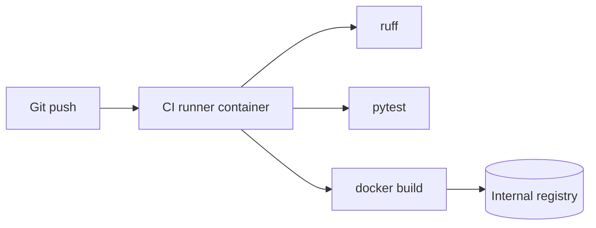

# 003. CI pipeline (build, test, lint)

**Статус:** done  
**Фаза:** milestone-1  
**Зависимости:** 001, 002

## Описание

Настроить CI на виртуалке через отдельный Docker-контейнер-сборщик: lint, тесты, сборка образов приложения, push в внутренний registry. Контейнер CI — изолированное пространство сборки, не смешивается с runtime-контейнерами бота.

## Scope

- `docker/ci.Dockerfile` — Go 1.22, golangci-lint, Python 3.12, ruff, pytest, docker-cli
- `Makefile` targets: `lint`, `test`, `build`, `push`
- `.github/workflows/ci.yml` **или** `scripts/ci.sh` + cron/webhook на VM (git push → запуск CI-контейнера)
- Pipeline stages:
  1. `lint` — golangci-lint + ruff
  2. `test` — go test + pytest
  3. `build` — `docker build` для bot (и заготовки api/ai)
  4. `push` — tag `registry.internal/anonimus/bot:$GIT_SHA` + `:latest`
- Кеш pip/docker layers между прогонами
- Fail fast: lint → test → build → push

## Acceptance criteria

- [x] Push в main/master запускает pipeline на VM (или через GitHub Actions runner на VM)
- [x] Lint и тесты блокируют push образа при падении
- [x] Успешный прогон публикует образ bot в internal registry
- [x] Образ из registry запускается и проходит echo smoke test
- [x] Секреты (registry credentials, BOT_TOKEN для e2e) не попадают в образ и git

## Технические заметки

### Схема на VM

- **Registry:** self-hosted (Harbor, GitLab Registry, или `registry:2` в Docker) — URL в `REGISTRY_URL`
- **CI runner:** контейнер с `-v /var/run/docker.sock` для sibling builds **или** Docker-in-Docker
- Альтернатива без dind: `docker build` на хосте VM, CI-контейнер только lint/test, build через shell на хосте
- Tagging: `$GIT_SHA`, `$GIT_BRANCH`, `latest` только для main
- `.env.ci.example`: `REGISTRY_URL`, `REGISTRY_USER`, `REGISTRY_PASSWORD`

## Out of scope

- Деплой на prod VM (задача 004)
- Multi-arch builds (arm64) — при необходимости позже
- SAST/dependency scanning — добавить в 035
