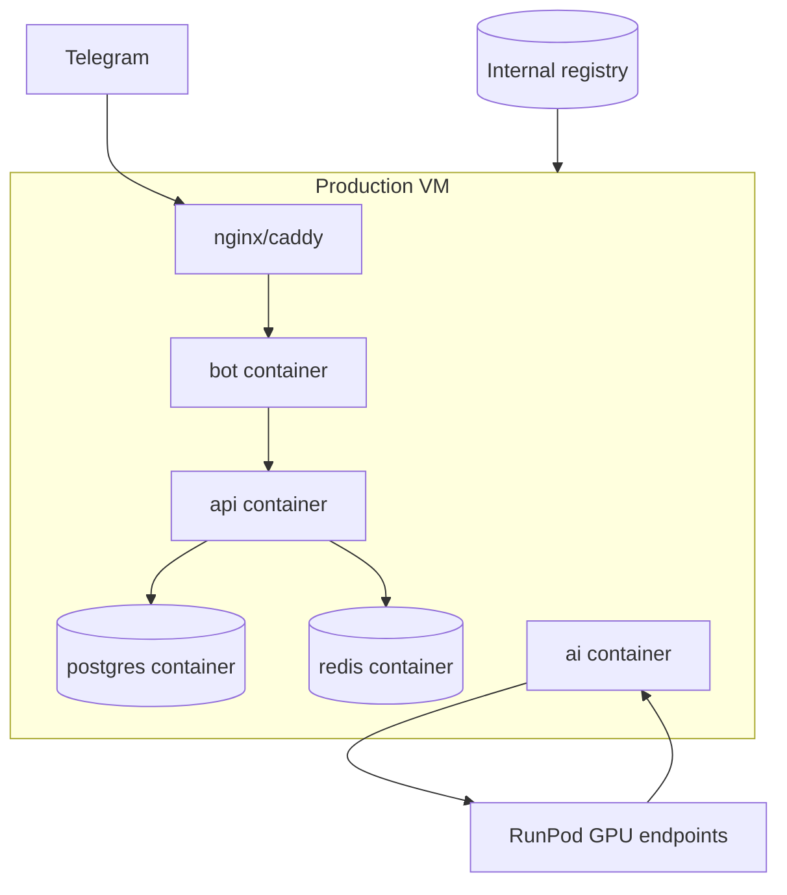

# 004. VM deploy (Docker on virtual machines)

**Статус:** done  
**Фаза:** milestone-1  
**Зависимости:** 003

## Описание

Развернуть echo-бота на виртуалке: pull образа из internal registry, docker compose для runtime-стека. Заложить паттерн деплоя, который потом масштабируется на postgres, redis, api, ai.

## Scope

- `docker-compose.prod.yml` на VM: сервис `bot` (на первом этапе — только он)
- `scripts/deploy.sh`: pull image by tag → `docker compose up -d` → health check
- `.env.prod.example`: `BOT_TOKEN`, `REGISTRY_URL`, `IMAGE_TAG`, `WEBHOOK_URL` (placeholder)
- Reverse proxy (nginx/caddy) для HTTPS webhook — заготовка, полная настройка в 009
- Systemd unit или cron для auto-restart / watchtower (optional)
- Rollback: `deploy.sh --tag <previous-sha>`
- Документация: минимальный runbook в README или `docs/deploy.md`

## Acceptance criteria

- [x] Echo-бот работает на VM, отвечает в Telegram
- [x] Деплой нового tag из registry без ручной сборки на prod VM
- [x] `docker compose ps` показывает healthy bot
- [x] Rollback на предыдущий tag работает за < 2 мин
- [x] Секреты только в `.env` на VM, не в compose-файлах

## Технические заметки

### Целевая топология

- **Milestone 1:** только `bot` на VM
- **Milestone 2 (005):** postgres + redis локально в compose на той же VM (не managed cloud)
- **RunPod:** LLM и embedding — внешние HTTP endpoint'ы, не контейнеры на VM (задача 036)
- БД персистентность: named volume для postgres data dir
- Бэкапы postgres — чеклист в 035

## Out of scope

- Kubernetes / swarm orchestration
- Multi-VM load balancing
- Managed Postgres (всё on-VM в Docker)
