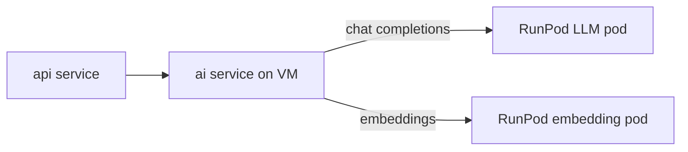

# 036. RunPod inference (LLM + embeddings)

**Статус:** todo  
**Фаза:** ai-infra  
**Зависимости:** 001, 005

## Описание

Заложить интеграцию с RunPod для inference-моделей вне prod VM: chat LLM для диалогов и embedding-модель для семантического поиска фото. Сервис `ai/` на VM ходит в RunPod по HTTP, не держит GPU локально.

## Scope

- Env-переменные в `.env.example`:
  - `RUNPOD_LLM_URL` — OpenAI-compatible chat completions endpoint
  - `RUNPOD_LLM_API_KEY`
  - `RUNPOD_EMBEDDING_URL` — embeddings endpoint
  - `RUNPOD_EMBEDDING_API_KEY`
  - `RUNPOD_REQUEST_TIMEOUT_SEC` (default 30)
- `internal/ai/runpod/client.go`: HTTP client (net/http), retry, timeout, structured errors
- Health probe: `GET /health/runpod` — ping обоих endpoint'ов или degraded mode
- Circuit breaker при серии 5xx / timeout
- Логирование latency, token usage (если API отдаёт)
- Документация: какой template/pod на RunPod, как обновлять endpoint URL

## Acceptance criteria

- [ ] `ai/` сервис вызывает LLM endpoint и получает completion
- [ ] Embedding endpoint возвращает vector фиксированной размерности
- [ ] При недоступности RunPod — graceful error, не crash процесса
- [ ] Секреты только в env, не в коде
- [ ] Latency и ошибки пишутся в structured logs (для 033)

## Технические заметки

- **LLM:** vLLM / TGI / llama.cpp server с OpenAI-compatible API на RunPod
- **Embeddings:** отдельный pod (e5, bge-m3 или аналог); batch size 1–32
- Dev/staging: можно один pod на обе задачи, prod — раздельные pods для независимого scaling
- Стоимость: cold start RunPod учитывать в 035 (keep-alive vs serverless)
- Не хранить GPU weights в Docker-образах на VM

## Out of scope

- Обучение / fine-tuning моделей
- Локальный inference на VM
- Prompt engineering (017, 019)
