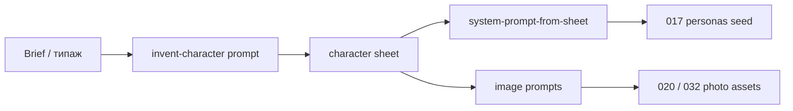

# 039. Persona generation prompts & templates

**Статус:** todo  
**Фаза:** ai  
**Зависимости:** — (можно параллельно с 036/016; результат питает 017 и 032)

## Описание

Отдельный контент-пайплайн для **придумывания** AI-персонажей и **генерации** их визуала: шаблоны анкеты персоны + промпты для LLM (character design) и для image model (фото). Не runtime system prompt диалога (это 017), а offline-инструменты, которыми наполняем каталог персон.

## Scope

### 1. Шаблон персонажа (character sheet)

Единый YAML/Markdown-шаблон, из которого потом собирается `system_prompt` (017) и image prompts:

- имя, возраст, город/контекст
- внешность (коротко + детально для image gen)
- характер, speech style, flirty level
- границы поведения (что нельзя)
- язык (RU/EN)
- типаж для фото-каталога (safe / adult tags)
- `prompt_version` / заметки для A/B

Файлы (предложение):

```
personas/
  templates/
    character-sheet.yaml      # схема полей
    character-sheet.example.yaml
  prompts/
    invent-character.md       # LLM: придумать персону по брифу
    system-prompt-from-sheet.md  # LLM: склеить sheet → system_prompt для 017
    image-portrait.md         # image model: портрет / selfie
    image-variations.md       # набор ракурсов/сцен для каталога (020/032)
```

### 2. Промпт «придумать персонажа»

- Вход: бриф (типаж: застенчивая / дерзкая / …, возраст-диапазон, язык)
- Выход: заполненный character sheet по шаблону
- Вариативность: 1 бриф → N черновиков на выбор
- Чеклист качества: не раскрывать AI, консистентная внешность, пригодность для flirty-чата

### 3. Промпты генерации изображений

- Базовый portrait prompt + negative prompt
- Вариации: selfie, casual, evening, adult-safe tags (без явного NSFW в git, если политика так решит)
- Consistency: якорь внешности из sheet (hair, eyes, age look)
- Документировать рекомендуемую модель/сервис (вне RunPod chat; image gen может быть отдельный инструмент)

### 4. Связка с кодом (минимальная)

- README в `personas/` — как пройти путь: бриф → sheet → system_prompt → seed в 017
- 1–2 готовых примера sheet (например «Алиса») для ручного прогона
- **Не** обязателен runtime endpoint в этом тикете — можно offline (ChatGPT / локальный скрипт)

## Acceptance criteria

- [ ] Есть шаблон character sheet + пример заполнения
- [ ] Есть промпт invent-character с примером входа/выхода
- [ ] Есть промпт(ы) image gen (portrait + variations) + negative prompt
- [ ] Есть промпт/инструкция: sheet → `system_prompt` совместимый с 017
- [ ] Документирован workflow: как из брифа получить персону для seed/rollout (032)
- [ ] Минимум один полный пример персонажа (sheet + system_prompt draft)

## Технические заметки



- Runtime dialog prompts = **017**; эта задача = **authoring toolkit**
- Image generation **вне** prod VM / Docker bot (offline pipeline)
- Не коммитить бинарные фото в git — только промпты, sheets, scripts
- Adult-контент: держать отдельные prompt-ветки / теги, не смешивать с safe seed без явного решения

## Out of scope

- Runtime назначение персоны в матче (017)
- 5 персон в prod + A/B (032)
- Photo catalog / embedding search (020)
- Real-time генерация фото в диалоге
- Fine-tune моделей
