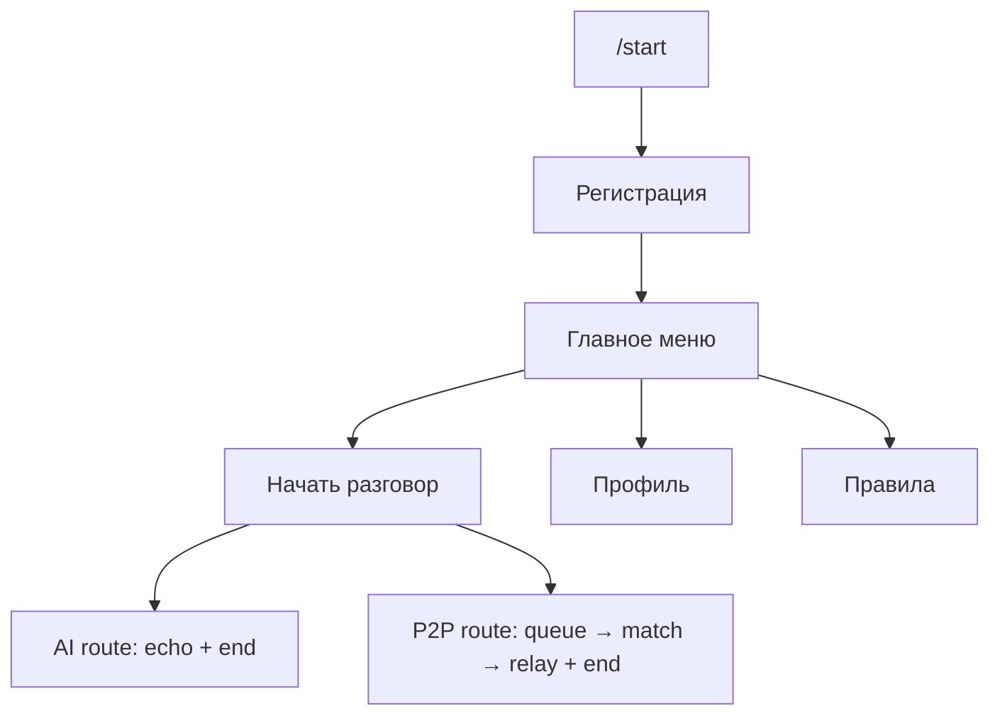

# Milestone 2 — Полный бот (без real AI)

**Цель:** весь пользовательский функционал бота работает end-to-end.  
**Исключение:** AI-общение — echo-заглушка (038), real LLM позже (016+).

## Уже готово

| # | Задача |
|---|--------|
| 001–004 | CI/CD, deploy |
| 005–008 | Infra, events |
| 010–011 | Регистрация, главное меню |
| 013–015 | Match routing, queue UX, end dialog |
| 024 | P2P matchmaking (M+M, F+M) |
| 025 | P2P relay & moderation |
| 026 | Profile view |
| 038 | AI echo stub |

## Очередь (делаем дальше)

| Приоритет | # | Задача | Зачем |
|-----------|---|--------|-------|
| 1 | 030 | Rules page | Вместо stub в меню «Правила» |
| 2 | 012 | i18n RU/EN | Все строки в locale-файлах |
| 3 | 027 | Edit profile | Смена анкеты |
| 4 | 028 | Change language | Язык UI |
| 5 | 029 | Delete profile | Удаление + anti-abuse |

## Отложено (после Milestone 2)

| Блок | Задачи |
|------|--------|
| Real AI | 036 RunPod, 016–019, 017 personas |
| Live F priority | 037 |
| Фото + Stars | 020–023, 031 |
| Метрики + launch | 032–035 |
| Webhook | 009 (long polling ок) |

## User journey (Milestone 2 done)

## Критерий закрытия Milestone 2

- [ ] Все 4 комбинации gender/seeking дают рабочий dialog (AI echo или P2P relay)
- [ ] Профиль и правила — полноценные экраны
- [ ] RU/EN переключается
- [ ] End dialog работает для AI и P2P
- [ ] Real AI не требуется
