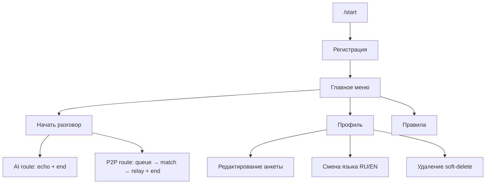

# Milestone 2 — Полный бот (без real AI)

**Статус:** ✅ feature-complete (осталась E2E-верификация)  
**Цель:** весь пользовательский функционал бота работает end-to-end.  
**Исключение:** AI-общение — echo-заглушка (038), real LLM позже (016+).

## Готово

| # | Задача |
|---|--------|
| 001–004 | CI/CD, deploy |
| 005–008 | Infra, events |
| 010–011 | Регистрация, главное меню |
| 012 | i18n RU/EN |
| 013–015 | Match routing, queue UX, end dialog |
| 024 | P2P matchmaking (M+M, F+M) |
| 025 | P2P relay & moderation |
| 026–029 | Profile: view, edit, language, delete |
| 030 | Rules page |
| 038 | AI echo stub |

## Маршрутизация (актуальная)

| Пол | Ищу | Маршрут |
|-----|-----|---------|
| M | F | AI (echo) |
| M | M | P2P |
| F | F | AI (echo) |
| F | M | P2P |

## User journey

## Критерии закрытия Milestone 2

- [ ] **E2E:** все 4 комбинации gender/seeking → рабочий dialog (AI echo или P2P relay)
- [ ] **E2E:** end dialog работает для AI и P2P (partner notified в P2P)
- [x] Профиль и правила — полноценные экраны
- [x] RU/EN переключается
- [x] Real AI не требуется (echo stub достаточно)

## Не в scope Milestone 2 (отложено)

| Блок | Задачи | Зачем |
|------|--------|-------|
| Real AI | 036, 016–019, 017 | RunPod LLM вместо echo |
| Live F priority | 037 | Приоритет живых F в очереди M→F |
| Фото + Stars | 020–023, 031 | Каталог, blur, оплата, premium UI |
| Delete unlock UI | часть 029 + 021 | Бесплатный unlock adult-фото при удалении |
| Webhook | 009 | Long polling достаточно |
| Метрики + launch | 032–035 | Personas rollout, метрики, чеклист запуска |

## Следующий шаг

1. **Smoke E2E на проде** — прогнать 4 маршрута + profile flow + delete/re-register.
2. **Выбрать Milestone 3** (рекомендуемый порядок ниже).
