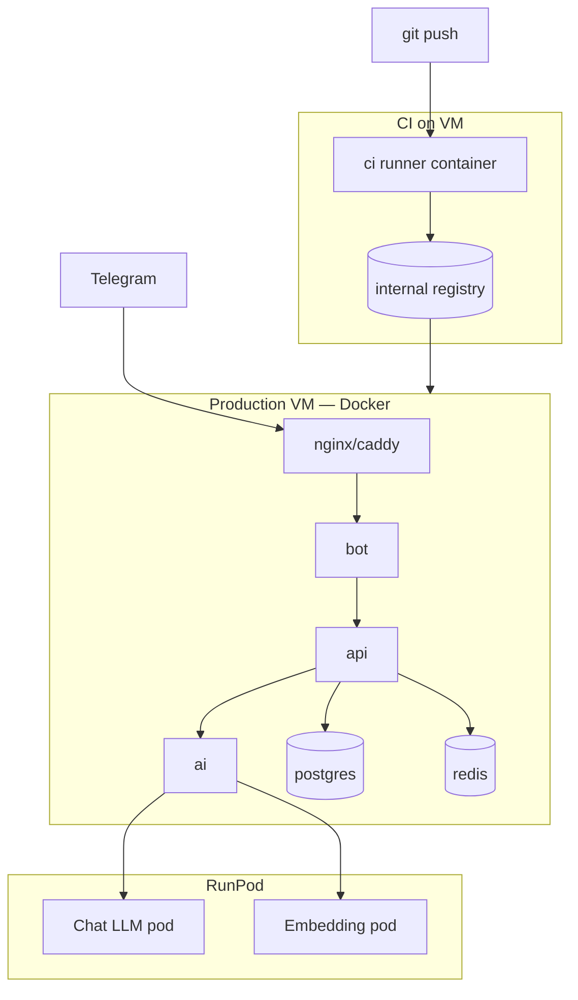
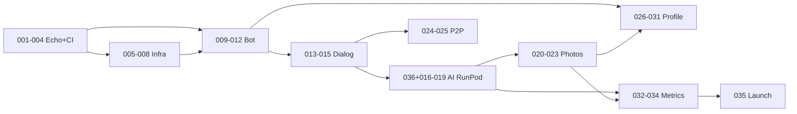

# Backlog — anonimus_chat

Telegram-бот для анонимного общения и обмена фотографиями.

## Стек

| Компонент | Технология |
|-----------|------------|
| **bot, api, ai** | Go 1.22+ |
| **Миграции БД** | [goose](https://github.com/pressly/goose) (SQL) |
| **Postgres / Redis** | Docker на VM |
| **Inference** | RunPod (HTTP) |

## Принципы деплоя

- **Prod VM:** все runtime-сервисы (bot, api, ai, **postgres, redis**) — Docker-контейнеры на виртуалке
- **CI:** отдельный build-контейнер на VM — lint, test, `docker build`, push в **internal registry**
- **Inference:** chat LLM и embedding-модель — **RunPod** (HTTP API), не на prod VM

## Архитектура

## Шаблон задачи

Каждый файл: статус, фаза, зависимости, описание, scope, acceptance criteria, технические заметки, out of scope.

---

## Milestone 1 — Echo bot + CI/CD (старт здесь)

| # | Задача | Статус |
|---|--------|--------|
| 001 | [Project scaffold](001-project-scaffold.md) | done |
| 002 | [Echo bot](002-echo-bot.md) | done |
| 003 | [CI pipeline (build, test, lint)](003-ci-pipeline.md) | done |
| 004 | [VM deploy + internal registry](004-vm-deploy-registry.md) | done |

**Результат milestone 1:** echo-бот в Telegram, образ собирается в CI, деплоится на VM из registry.

---

## Фаза 0 — Инфраструктура данных (005–008)

| # | Задача | Статус |
|---|--------|--------|
| 005 | [Docker Compose (dev + prod stack)](005-docker-compose.md) | done |
| 006 | [Database schema](006-database-schema.md) | done |
| 007 | [Redis queues & sessions](007-redis-queues-sessions.md) | done |
| 008 | [Event logging](008-event-logging.md) | todo |

---

## Фаза 1 — Telegram Bot (009–012)

| # | Задача | Статус |
|---|--------|--------|
| 009 | [Telegram bot webhook](009-telegram-bot-webhook.md) | todo |
| 010 | [Registration FSM](010-registration-fsm.md) | todo |
| 011 | [Main menu](011-main-menu.md) | todo |
| 012 | [i18n RU/EN](012-i18n-ru-en.md) | todo |

---

## Фаза 2 — Диалоги и матчинг (013–015)

| # | Задача | Статус |
|---|--------|--------|
| 013 | [Match routing](013-match-routing.md) | todo |
| 014 | [Queue UX](014-queue-ux.md) | todo |
| 015 | [End dialog flow](015-end-dialog-flow.md) | todo |

---

## Фаза 3 — AI + RunPod (036, 016–019)

| # | Задача | Статус |
|---|--------|--------|
| 036 | [RunPod inference (LLM + embeddings)](036-runpod-inference.md) | todo |
| 016 | [AI dialog service](016-ai-dialog-service.md) | todo |
| 017 | [Persona prompts](017-persona-prompts.md) | todo |
| 018 | [AI end dialog heuristics](018-ai-end-dialog-heuristics.md) | todo |
| 019 | [Photo intent classifier](019-photo-intent-classifier.md) | todo |

---

## Фаза 4 — Фото и монетизация (020–023)

| # | Задача | Статус |
|---|--------|--------|
| 020 | [Photo catalog (+ embedding search)](020-photo-catalog.md) | todo |
| 021 | [Photo delivery & blur](021-photo-delivery-blur.md) | todo |
| 022 | [Telegram Stars payments](022-telegram-stars-payments.md) | todo |
| 023 | [Premium logic](023-premium-logic.md) | todo |

---

## Фаза 5 — P2P (024–025)

| # | Задача | Статус |
|---|--------|--------|
| 024 | [P2P matchmaking](024-p2p-matchmaking.md) | todo |
| 025 | [P2P relay & moderation](025-p2p-relay-moderation.md) | todo |

---

## Фаза 6 — Профиль и правила (026–031)

| # | Задача | Статус |
|---|--------|--------|
| 026 | [Profile view](026-profile-view.md) | todo |
| 027 | [Edit profile](027-edit-profile.md) | todo |
| 028 | [Change language](028-change-language.md) | todo |
| 029 | [Delete profile anti-abuse](029-delete-profile-antiabuse.md) | todo |
| 030 | [Rules page](030-rules-page.md) | todo |
| 031 | [Premium purchase menu](031-premium-purchase-menu.md) | todo |

---

## Фаза 7 — Персоны и метрики (032–034)

| # | Задача | Статус |
|---|--------|--------|
| 032 | [Personas rollout](032-personas-rollout.md) | todo |
| 033 | [Metrics: median dialog duration](033-metrics-median-dialog-duration.md) | todo |
| 034 | [Churn attribution](034-churn-attribution.md) | todo |

---

## Фаза 8 — Запуск (035)

| # | Задача | Статус |
|---|--------|--------|
| 035 | [Traffic launch checklist](035-traffic-launch-checklist.md) | todo |

---

## Зависимости фаз

- **Milestone 1** можно закрыть до Postgres/Redis — только bot + CI + VM
- P2P (024–025) и AI-ветка (036, 016–023) параллельны после фазы 2
- RunPod (036) — до AI dialog (016), embeddings используются в 020
