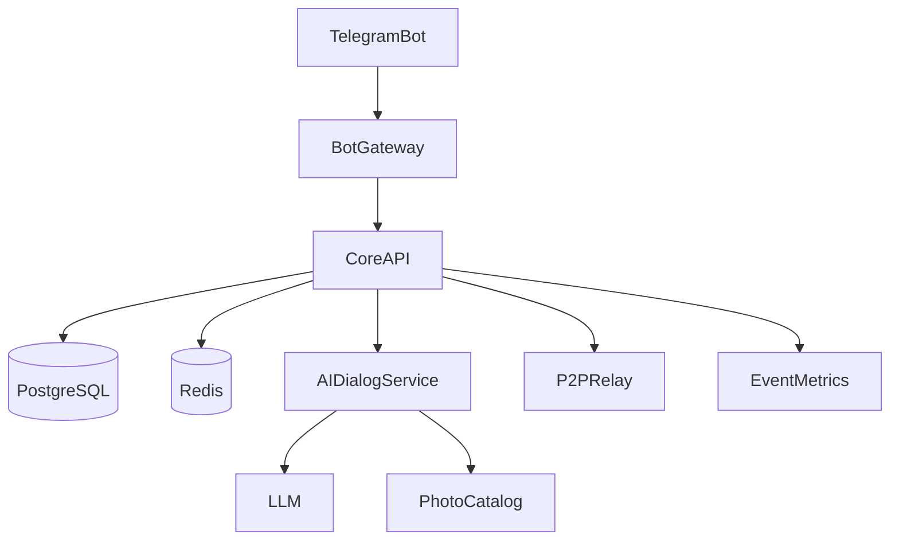
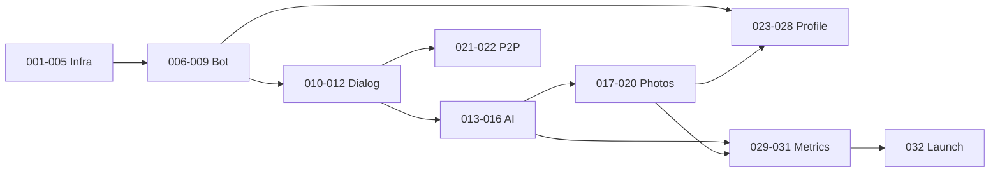

# Backlog — anonimus_chat

Telegram-бот для анонимного общения и обмена фотографиями. Задачи нумерованы в рекомендуемом порядке реализации.

## Архитектура

## Шаблон задачи

Каждый файл следует единому формату: статус, фаза, зависимости, описание, scope, acceptance criteria, технические заметки, out of scope.

## Все задачи

### Фаза 0 — Инфраструктура (001–005)

| # | Задача | Статус |
|---|--------|--------|
| 001 | [Project scaffold](001-project-scaffold.md) | todo |
| 002 | [Docker Compose](002-docker-compose.md) | todo |
| 003 | [Database schema](003-database-schema.md) | todo |
| 004 | [Redis queues & sessions](004-redis-queues-sessions.md) | todo |
| 005 | [Event logging](005-event-logging.md) | todo |

### Фаза 1 — Telegram Bot (006–009)

| # | Задача | Статус |
|---|--------|--------|
| 006 | [Telegram bot webhook](006-telegram-bot-webhook.md) | todo |
| 007 | [Registration FSM](007-registration-fsm.md) | todo |
| 008 | [Main menu](008-main-menu.md) | todo |
| 009 | [i18n RU/EN](009-i18n-ru-en.md) | todo |

### Фаза 2 — Диалоги и матчинг (010–012)

| # | Задача | Статус |
|---|--------|--------|
| 010 | [Match routing](010-match-routing.md) | todo |
| 011 | [Queue UX](011-queue-ux.md) | todo |
| 012 | [End dialog flow](012-end-dialog-flow.md) | todo |

### Фаза 3 — AI Dialog Service (013–016)

| # | Задача | Статус |
|---|--------|--------|
| 013 | [AI dialog service](013-ai-dialog-service.md) | todo |
| 014 | [Persona prompts](014-persona-prompts.md) | todo |
| 015 | [AI end dialog heuristics](015-ai-end-dialog-heuristics.md) | todo |
| 016 | [Photo intent classifier](016-photo-intent-classifier.md) | todo |

### Фаза 4 — Фото и монетизация (017–020)

| # | Задача | Статус |
|---|--------|--------|
| 017 | [Photo catalog](017-photo-catalog.md) | todo |
| 018 | [Photo delivery & blur](018-photo-delivery-blur.md) | todo |
| 019 | [Telegram Stars payments](019-telegram-stars-payments.md) | todo |
| 020 | [Premium logic](020-premium-logic.md) | todo |

### Фаза 5 — P2P (021–022)

| # | Задача | Статус |
|---|--------|--------|
| 021 | [P2P matchmaking](021-p2p-matchmaking.md) | todo |
| 022 | [P2P relay & moderation](022-p2p-relay-moderation.md) | todo |

### Фаза 6 — Профиль и правила (023–028)

| # | Задача | Статус |
|---|--------|--------|
| 023 | [Profile view](023-profile-view.md) | todo |
| 024 | [Edit profile](024-edit-profile.md) | todo |
| 025 | [Change language](025-change-language.md) | todo |
| 026 | [Delete profile anti-abuse](026-delete-profile-antiabuse.md) | todo |
| 027 | [Rules page](027-rules-page.md) | todo |
| 028 | [Premium purchase menu](028-premium-purchase-menu.md) | todo |

### Фаза 7 — Персоны и метрики (029–031)

| # | Задача | Статус |
|---|--------|--------|
| 029 | [Personas rollout](029-personas-rollout.md) | todo |
| 030 | [Metrics: median dialog duration](030-metrics-median-dialog-duration.md) | todo |
| 031 | [Churn attribution](031-churn-attribution.md) | todo |

### Фаза 8 — Запуск (032)

| # | Задача | Статус |
|---|--------|--------|
| 032 | [Traffic launch checklist](032-traffic-launch-checklist.md) | todo |

## Зависимости фаз

P2P (021–022) и AI-ветка (013–020) могут выполняться параллельно после фазы 2.
